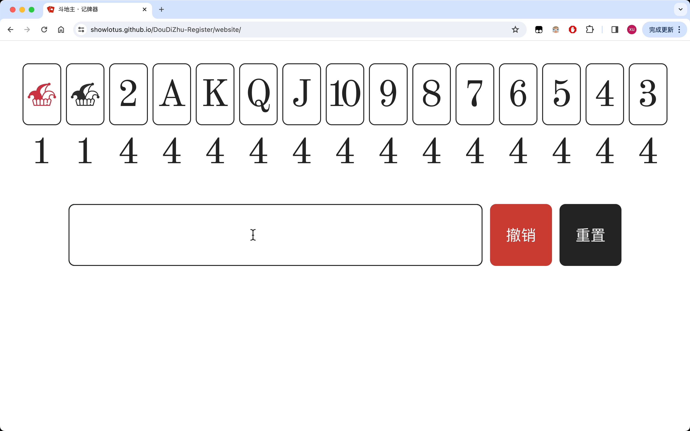

# 斗地主 · 记牌器

## 操作指导

- 在输入框中输入规则，点击 `Enter` 后触发；
- 使用方向键 `Up` 或 `Down` 采用智能提示的内容；
- “撤销”：撤销上一步输入的规则；
- “重置”：将所有牌重置为初始状态。

## 词法规则

| 键入字符        | 对应牌                          | 备注                                          |
| :-------------- | :------------------------------ | :-------------------------------------------- |
| `>`             | 大王                            | 大于号代表大王                                |
| `<`             | 小王                            | 小于号代表小王                                |
| `2`             | 2                               | -                                             |
| `A`             | A                               | -                                             |
| `K`             | K                               | -                                             |
| `Q`             | Q                               | -                                             |
| `J`             | J                               | -                                             |
| `10`            | 10                              | -                                             |
| `9`             | 9                               | -                                             |
| `8`             | 8                               | -                                             |
| `7`             | 7                               | -                                             |
| `6`             | 6                               | -                                             |
| `5`             | 5                               | -                                             |
| `4`             | 4                               | -                                             |
| `3`             | 3                               | -                                             |
| `D3`            | 两个 3                          | `D`：意思就是 `Double`                        |
| `T3`            | 三个 3                          | `T`：意思就是 `Three`                         |
| `F3`            | 四个 3                          | `F`：意思就是 `Four`                          |
| `<>` 或 `><`    | 两个王                          | 王炸                                          |
| `3,6,9,Q,A,2,<` | 3，6，9，Q，A，2，小王          | -                                             |
| `D3,D6,DK`      | 对 3，对 6，对 K                | 对子：以 `D` 开头                             |
| `3-8`           | 3，4，5，6，7，8                | 顺子：两段数字，中间通过短杠连接              |
| `D3-D5`         | 对 3，对 4，对 5                | 连对：两段以 `D` 开头的字符，中间通过短杠连接 |
| `T4,5`          | 三个 4，一个 5                  | 三带一                                        |
| `T4,D6`         | 三个 4，一对 6                  | 三带对                                        |
| `T5-T6,10,J`    | 三个 5，三个 6，一个 10，一个 J | 飞机带单                                      |
| `T5-T6,DQ,DA`   | 三个 5，三个 6，一对 Q ，一对 A | 飞机带双                                      |
| `F2`            | 四个 2                          | 炸弹                                          |
| `FA,5,7`        | 四个 A，一个 5，一个 7          | 四带单                                        |
| `FA,D5,D7`      | 四个 A，一对 5，一对 7          | 四带双                                        |
